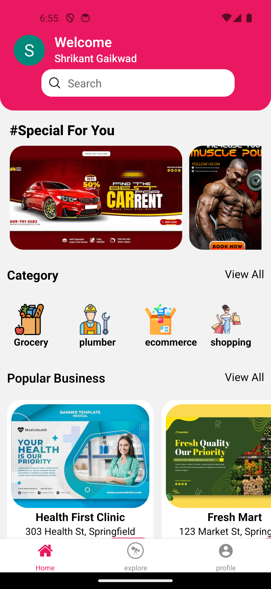

# Business Directory App

Welcome to the Business Directory App! This app is built using Expo and React Native, allowing users to browse and discover various businesses in different categories.
<p align="center">

</p>
## Features

- **Category Browsing:** Users can browse businesses by categories such as Grocery, Plumber, Ecommerce, Shopping, Salon, and Medical.
- **Business Details:** View detailed information about businesses, including address, contact information, and website.
- **Search Functionality:** Search for specific businesses or filter by category.
- **User-Friendly Interface:** Simple and intuitive user interface for seamless navigation.
- **Cross-Platform:** Compatible with both iOS and Android devices.

## Installation

To get started with the Business Directory App, follow these steps:

1. **Clone the Repository:**

    ```bash
    git clone https://github.com/shrikantg199/Business_directory_App.git
    cd Business_directory_App
    ```

2. **Install Dependencies:**

    ```bash
    npm install
    ```

3. **Start the Expo Server:**

    ```bash
    npx expo start
    ```

4. **Run on Your Device:**
    - For iOS: Open the Expo Go app and scan the QR code from the terminal.
    - For Android: Open the Expo Go app and scan the QR code from the terminal.

## Technologies Used

- **React Native**
- **Expo**
- **JavaScript**
- **React Navigation** (for navigation)
- **Axios** (for API calls)
